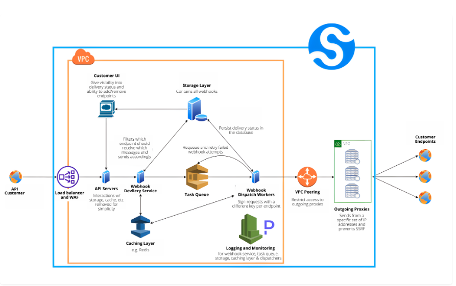

# What's webhooks?

- HTTP callback
- server-to-server
- sender-receiver

# Specification

## Payload

```json
{
  "type": "",
  "timestamp": "",
  "data": {}
}
```

## Verifying webhook authenticity

- Metadata
  - the timestamp of the attempt
  - a unique identifier
- Signature scheme
  - Symmetric / Asymmetric
- Webhook header
  - webhook-id
  - webhook-timestamp
  - webhook-signature

# Security

- During Setup: One time verification
- During Runtime: Symmetric / Asymmetric

# Resources

- https://github.com/standard-webhooks/standard-webhooks/blob/main/spec/standard-webhooks.md
- https://webhooks.fyi/

# Architecture


