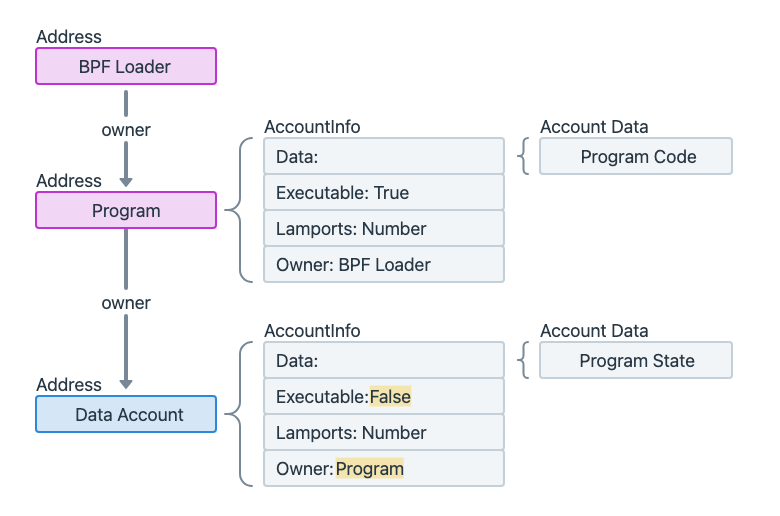

# Features

- 400ms confirmed block
- low fees
- high throughput

# Development

- Composable: build on top of deployed programs

## Types

- Onchain
  - Rust
  - Anchor: Framework
- Client-side
  - SDK

# Concepts

- Account model
- Transactions and instructions
- Fees
  - Transaction
  - Prioritization
  - Rent 
- Programs
- Program Derived Address (PDAs)
- Cross Program Invocation (CPI)
- Token
  - FT
  - NFT 
- RPC Endpoints

## Account model
- "Accounts" table
- ED25519

```
{
 data: state or executable program code
 executable
 lamports // balance
 owner
 rent_epoch
}
```

- Native program
  - System program
  - BPF loader
- BPF loader
- Sysvar program
- custom program
  - program account
  - data account



## Transaction && instructions

- instructions
  - order
  - atomic


## Fees
## Programs
- is the account store executable logic
- organized instructions
## PDA
## CPI
