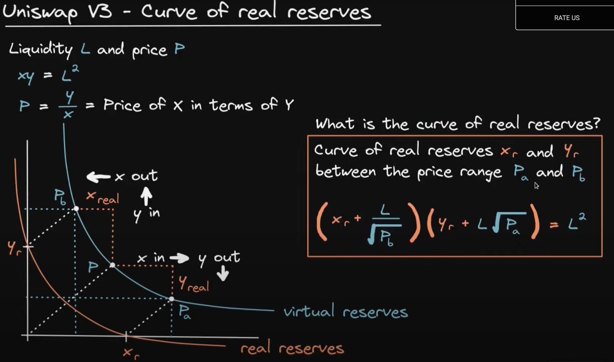
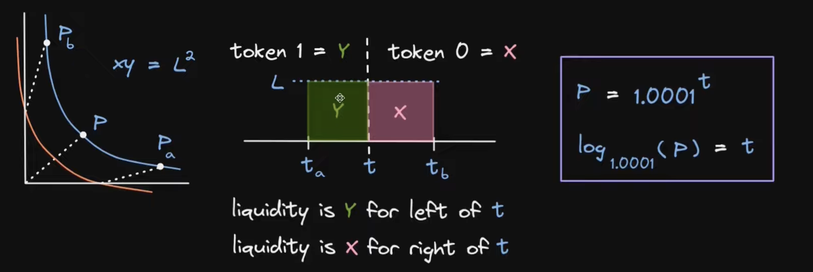
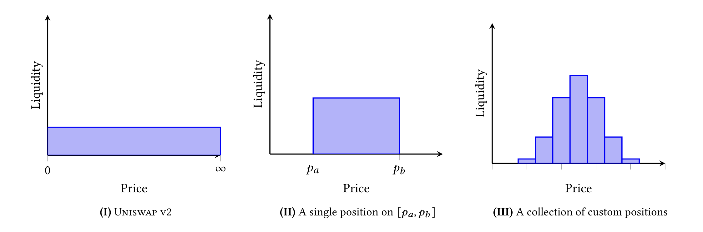

# Features

- Concentrated liquidity
- Flexible Fees: No longer 0.3%, support fee tires (0.05%, 0.3%, 1%)
- Improve price oracle: TWAP in version 2
- Liquidity Oracle: The contracts expose a time-weighted average liquidity oracle

# Concentrated liquidity

Motivation: concentrate their liquidity to smaller price ranges than (0, ∞)

- https://www.youtube.com/watch?v=fH7pzX_DpHQ
- https://www.youtube.com/watch?v=hf0fPW3MkHM

## How curve of real reserves?

- Instead of trade (0, ∞), liquidity trade from (Pa, Pb)



- From Uniswap V2 formula:

```
x * y = L^2 (liquidity)
P = y / x (Price)

=> Y = L * sqrt(P)
and X = L / sqrt(P)
```

- Uniswap V3 concentrated liquidity from (Pa, Pb)

```
X = Xreal + Xvirtual
Y = Yreal + Yvirtual
```

```
(Xreal + Xvirtual) * (Yreal + Yvirtual) = L^2
```

- When P = Pb => Xreal = 0, Y = (Yreal + Yvirtual) = L \* sqrt(Pb)

```
Xvirtual = L / sqrt(Pb)
```

- When P = pa => Yreal = 0, Y = ( Xreal + Xvirtual) = L / sqrt(Pa)

```
Yvirtual = L * sqrt(Pa)
```

- Combine

```
(Xreal + L / sqrt(Pb)) * (Yreal * L * sqrt(Pa)) = L^2 (1)
```

## How calculator liquidity from (Pa, Pb)

- If P <= Pa, Yreal = 0 and from (1)

```
L = Xreal * (sqrt(Pa) * sqrt(Pb) / (sqrt(Pb) - sqrt(Pa)))
```

- If P >= Pb, Xreal = 0 and from (1)

```
L = Yreal / (sqrt(Pb) - sqrt(Pa))
```

- If Pa < P < Pb

```
L = Xreal * (sqrt(P) * sqrt(Pb) / (sqrt(Pb) - sqrt(P))) = Yreal / (sqrt(P) - sqrt(Pa)) (2)
```

## Liquidity delta

- Uniswap V2

```
Lbefore = sqrt(X * Y)
Lafter = sqrt((X + deltaX) * (Y + deltaY))

L = x*sqrt(P) = y / sqrt(P)
=> deltaL = deltaX * sqrt(P) = deltaY / sqrt(P)
```

- Uniswap V3, from (2)

```
deltaL = deltaX / (1 / sqrt(P) - 1 / sqrt(Pb)) = deltaY / (sqrt(P) - sqrt(Pa))
```

## Liquidity Price Graph



## Others

- `sqrtPriceX96`: sqrt(P) \* 2 ^ 96
- `tick`: p = 1.0001^i

# Fee

# Range Orders


