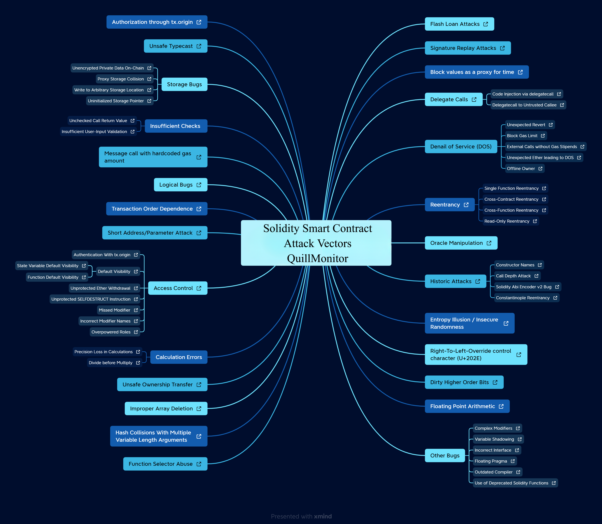

# Common vulnerabilities

- [x] Authorization through tx.origin
- [ ] Unsafe Typecase
- [ ] Storage Bugs
  - [x] Unencrypted private data on-chain
  - [ ] Proxy Storage Collision
  - [x] Write to Arbitrary Storage Location
  - [x] Uninitialized Storage Pointer (solve at solc > 0.5.0)
- [ ] Insufficient Checks
  - [x] Unchecked call return value
  - [ ] Insufficient User-Input validation
- [x] Message call with hardcoded gas amount
- [ ] Logical bugs
- [ ] Transaction order dependency
- [x] Short Address / Parameter Attack
- [ ] Access-control
  - [x] Authenticate with tx.origin
  - [x] Default visibility
    - [x] State variable default visibility (default `public`)
    - [x] Function default visibility (default `public`)
  - [ ] Unprotected Ether withdrawal
  - [ ] Unprotected SELTDESTRUCT instruction
  - [x] Missing modifier
  - [x] Incorrect modifier names
  - [x] Overpower roles
- [ ] Calculation Errors
  - [x] Precision loss in calculations (Divide before multiply)
- [x] Unsafe ownership transfer
- [x] Improper Array Deletion
- [x] Hash collisions with multiple variable length arguments (abi.encodePacked())
- [x] Function selector abuse
- [ ] Flash Loan attacks
- [x] Signature replay attacks
- [ ] Block values as proxy for time
- [ ] Delegate calls
  - [x] Code injection via delegate call
  - [x] Delegate call to untrusted callee
- [ ] Denail of service (DOS)
  - [x] Unexpected revert
  - [x] Block gas limit
  - [ ] External calls without gas stipends
  - [ ] Unexpected ether leading to DOS
  - [ ] Offline owner
- [ ] Reentrance
  - [ ] Single function reentrance
  - [ ] Cross-contract reentrance
  - [ ] Cross-function reentrance
  - [ ] Read-Only reentrance
- [ ] Oracle Manipulation
- [ ] Historic Attacks
  - [ ] Constructor names
  - [ ] Call depth attack
  - [ ] Solidity abi encoder v2 bug
  - [ ] Constantinople reentrancy
- [x] Entropy Illusion / Insecure randomness
- [ ] Right-to-Left-override control character (U+202E)
- [ ] Dirty High Order Bits
- [ ] Float point arithmetic
- [ ] Other bugs
  - [ ] Complex modifiers
  - [ ] Variable shadowing
  - [ ] Incorrect interface
  - [ ] Floating pragma
  - [ ] Outdated compiler
  - [ ] Use of Deprecated solidity functions
