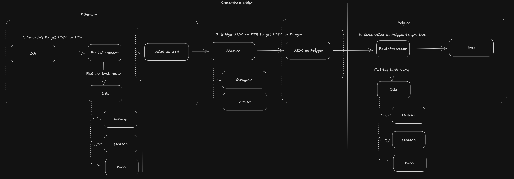

# Support cross-chain swap

- Uniswap (Planed) https://github.com/Uniswap/uniswapx-service/pull/396
- Pancakeswap (Not supported yet)
- Kyperswap (Supported few tokens)
- Sushiswap (Supported)

## Kyperswap

- https://kyberswap.com/cross-chain
- https://www.squidrouter.com/

## Sushiswap

- https://www.sushi.com/swap/cross-chain
- https://github.com/sushiswap/sushixswap-v2

E.g: https://www.sushi.com/swap/cross-chain?chainId0=1&chainId1=137&token0=0xEE06A81a695750E71a662B51066F2c74CF4478a0&token1=0x9c2C5fd7b07E95EE044DDeba0E97a665F142394f&swapAmount=1.5

