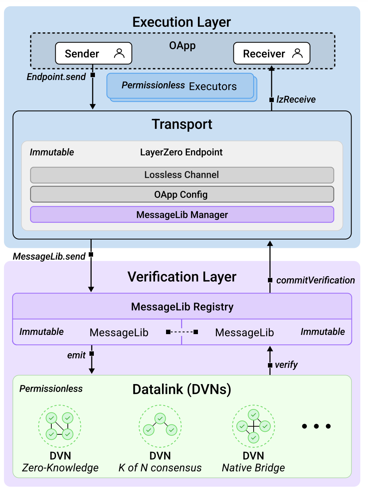
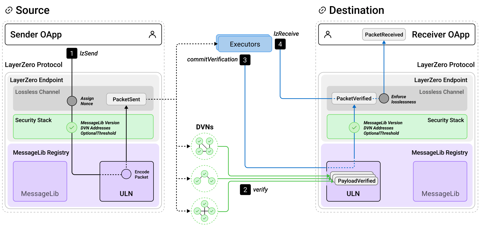
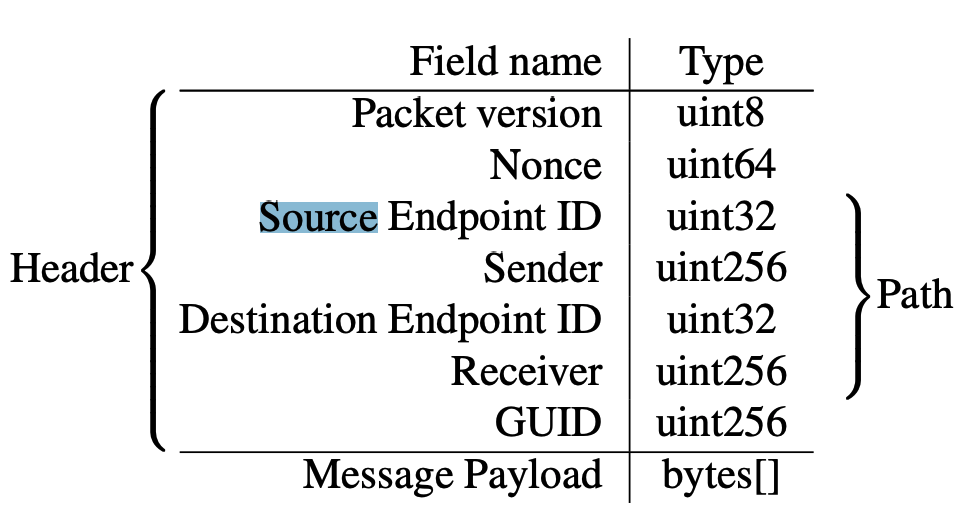

# Layer Zero

## Overview

- `intrinsically secure` and `semantically universal` omnichain interoperability protocol
- first omnichain message protocol (fully-connected mesh network)

### Use case

- Send arbitrary data
- external function calls
- tokens

### Version

- LayerZero V1
- LayerZero V2

### Terms:

- OApp
- OFT
- DVNs
- Executors
- MessageLib
- LZ endpoint
- Mesh network

## Intrinsically Security

- OApp Security Stack

## Semantically Universal

- ability to extend and adapt the network primitive
  to all additional use cases and blockchains

## How it works

### Components

### Steps

- Step 1: OAppSender call `lzSend()`

- Step 2: the configured DVNs each independently verify the packet on the destination MessageLib
- Step 3: a worker (e.g., executor, DVN, user) commits the packet to the Endpoint in step
- Step 4: an executor calls `lzReceive()`

## Contracts

### OApp

- OAppSender
  - `lzSend`
- OAppReceiver
  - `lzReceive`

### OFT

### Endpoint

### MessageLib

## Resources

- Docs: https://docs.layerzero.network/
- Paper: https://layerzero.network/publications/LayerZero_Whitepaper_V2.1.0.pdf
- LZ contract V2: https://github.com/LayerZero-Labs/LayerZero-v2
