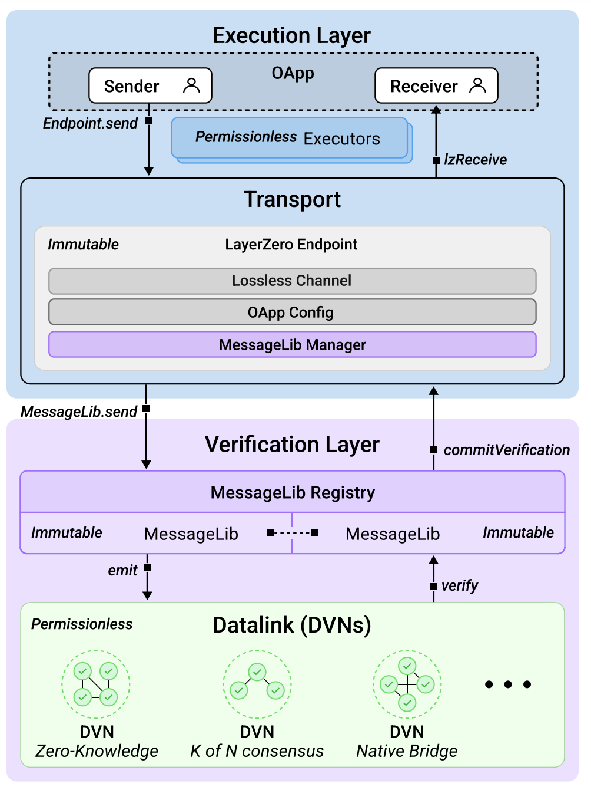
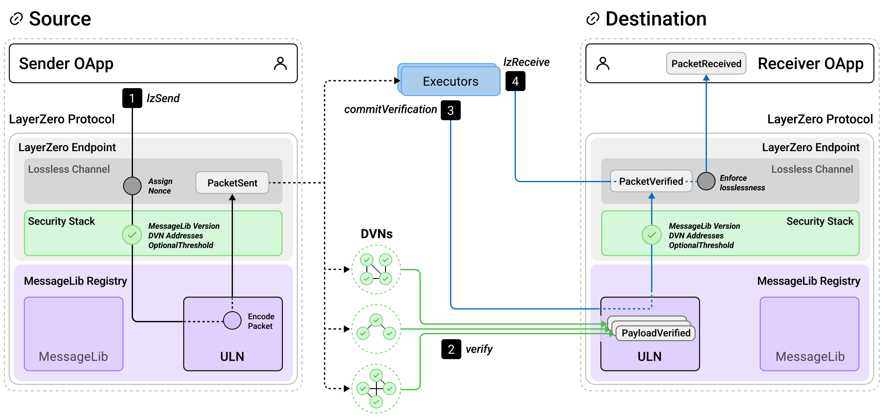

# Layer Zero

## Overview

- `intrinsically secure` and `semantically universal` omnichain interoperability protocol
- first omnichain message protocol (fully-connected mesh network)

### Use case

- Send arbitrary data
- external function calls
- tokens

### Version

- LayerZero V1
- LayerZero V2

### Terms:

- OApp
- OFT
- DVNs
- Executors
- MessageLib
- LZ endpoint
- Mesh network

## Intrinsically Security

- OApp Security Stack

## Semantically Universal

- ability to extend and adapt the network primitive
  to all additional use cases and blockchains

## How it works

## Contracts

### OApp

- OAppSender
  - `lzSend`
- OAppReceiver
  - `lzReceive`
- Compose
  - `lzCompose`

### OFT

### Endpoint

### MessageLib

## Building protocol

### Usecase

- Use case 1: ERC20 - ERC20

  - https://docs.layerzero.network/contracts/oft
  - https://docs.layerzero.network/contracts/deploy-same-addresses
  - Governance:
    - https://docs.layerzero.network/contracts/oft#security-and-governance
    - https://github.com/LayerZero-Labs/omnichain-governance-executor

- Use case 2: Transfer native token

  - Opt 1: Protocols or DEXs Built on LayerZero
  - Opt 2: Wrapped Asset Bridges

- Use case 3: Native to Native

  - https://github.com/LayerZero-Labs/mainnet-testnet-bridge

- Use case 4: ERC721

### Deployments

#### Contracts

1. Building omnichain applications (Building oapps contracts)

- create-lz-oapp@latest
- https://github.com/LayerZero-Labs/solidity-examples

2. Oapp
3. OFT

- OFT.sol: bridge ERC20 inherit OFT (mint/burn)
- OFTAdapter.sol: bridge ERC20 native (lock/mint)

#### UI

- https://github.com/telosnetwork/telos-bridge

1. `/bridge`
2. `/oft`
3. `/onft`

## Architecture

- Execution Layer
  - OApp
    - Sender
    - Receiver
  - Endpoint
    - Lossless channel
    - OApp config
    - MessageLib manager
  - Executors
- Verification Layer

  - MessageLib registry
  - DVNs
    - ZK
    - k of N consensus
    - Native bridge

- 4 components:

  - Endpoint
  - MessageLib registry (append-only)
  - DVNs
  - Executors

### Message transmission

- Step 1: OAppSender call `lzSend()`

- Step 2: the configured DVNs each independently verify the packet on the destination MessageLib
- Step 3: a worker (e.g., executor, DVN, user) commits the packet to the Endpoint in step
- Step 4: an executor calls `lzReceive()`

### Endpoint

- `send()` - send Sends a message through LayerZero.
- `getInboundNonce` - Returns the largest nonce with all predecessors received
- `lzReceive()` - Called by the executor to receive a message from the channel.

- To handle erroneously sent messages or malicious packets
  - Called by the receiver
    - `skip()` - skip delivery
    - `clear()` - skip both verification and delivery
  - Called by the executor
    - `nilify()` - invalidates a verified packet
    - `burn()` - clear a packet without knowing the packet contents; this is useful if a faulty Security Stack commits an invalid has to the endpoint, or if an OApp needs to clear a nilified nonce

#### Requirement

- Lossless
- Exactly-one

### MessageLib

- Ultra Light Node (ULN)

### DVNs

### Executors

## Contract

### Analysis

- EndpointV2.sol
  - MessagingChannel.sol
  - MessageLibManager.sol
  - MessagingComposer.sol
  - MessagingContext.sol
- MessageLib.sol
  - MessageLibRegistry.sol is collection of MessageLib
  - responsible for securely emitting packets on the source chain and verifying them on the destination MessageLib
  - ULN.sol
    - is the baseline MessageLib included in every LayerZero deployment
    - implements the minimal set of fundamental features necessary for any verification algorithm and is thus universally compatible with all blockchains
    - composition of up to 254 DVNs
    - DVN.sol
      - Worker
    - Executor.sol

## Extensions

- the protocol can be extended with additional execution features

### Sources

### FT

- https://github.com/LayerZero-Labs/solidity-examples/blob/main/contracts/token/oft/v2/OFTV2.sol
- https://github.com/LayerZero-Labs/solidity-examples/blob/main/contracts/token/oft/v2/ProxyOFTV2.sol
- https://github.com/LayerZero-Labs/solidity-examples/blob/main/contracts/token/oft/v2/NativeOFTV2.sol

- Wrapper
  - https://github.com/LayerZero-Labs/oft-wrapper
- Bridge
  - https://github.com/LayerZero-Labs/wrapped-asset-bridge

### NFT

- ERC721
  - https://github.com/LayerZero-Labs/solidity-examples/blob/main/contracts/token/onft721/ONFT721.sol
  - https://github.com/LayerZero-Labs/solidity-examples/blob/main/contracts/token/onft721/ProxyONFT721.sol
- ERC1155
  - https://github.com/LayerZero-Labs/solidity-examples/blob/main/contracts/token/onft1155/ONFT1155.sol
  - https://github.com/LayerZero-Labs/solidity-examples/blob/main/contracts/token/onft1155/ProxyONFT1155.sol

## Resources

- Docs: https://docs.layerzero.network/
- Paper: https://layerzero.network/publications/LayerZero_Whitepaper_V2.1.0.pdf
- LZ contract V2: https://github.com/LayerZero-Labs/LayerZero-v2
- UI:
  - https://github.com/telosnetwork/telos-bridge
  - https://github.com/fuseio/fuse-bridge-v2-dapp
