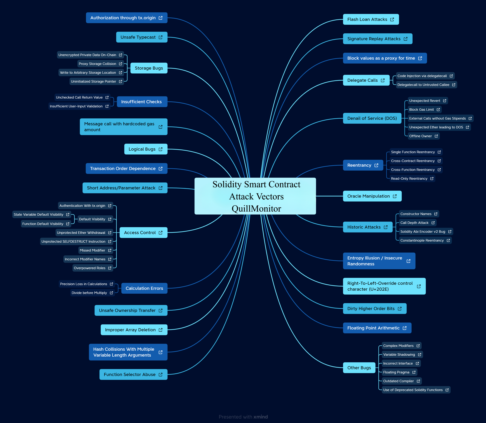

# Common vulnerabilities

- [ ] Authorization through tx.origin
- [ ] Unsafe Typecase
- [ ] Storage Bugs
  - [ ] Unencrypted private data on-chain
  - [ ] Proxy Storage Collision
  - [ ] Write to Arbitrary Storage Location
  - [ ] Uninitialized Storage Pointer
- [ ] Insufficient Checks
  - [ ] Unchecked call return value
  - [ ] Insufficient User-Input validation
- [ ] Message call with hardcoded gas amount
- [ ] Logical bugs
- [ ] Transaction order dependency
- [ ] Short Address / Parameter Attack
- [ ] Access-control
  - [ ] Authenticate with tx.origin
  - [ ] Default visibility
    - [ ] State variable default visibility
    - [ ] Function default visibility
  - [ ] Unprotected Ether withdraw
  - [ ] Unprotected SELTDESTRUCT instruction
  - [ ] Missing modifier
  - [ ] Incorrect modifier names
  - [ ] Overpower roles
- [ ] Calculation Errors
  - [ ] Precision loss in calculations
  - [ ] Divide before multiply
- [ ] Unsafe ownership transfer
- [ ] Improper array delete
- [ ] Has collisions with multiple variable length arguments
- [ ] Function select abuse
- [ ] Flash Loan attacks
- [ ] Signature replay attacks
- [ ] Block values as proxy for time
- [ ] Delegate calls
  - [ ] Code injection via delegate call
  - [ ] Delegate call to untrusted callee
- [ ] Denail of service (DOS)
  - [ ] Unexpected revert
  - [ ] Block gas limit
  - [ ] External calls without gas stipends
  - [ ] Unexpected ether leading to DOS
  - [ ] Offline owner
- [ ] Reentrance
  - [ ] Single function reentrance
  - [ ] Cross-contract reentrance
  - [ ] Cross-function reentrance
  - [ ] Read-Only reentrance
- [ ] Oracle Manipulation
- [ ] Historic Attacks
  - [ ] Constructor names
  - [ ] Call depth attack
  - [ ] Solidity abi encoder v2 bug
  - [ ] Constantinople reentrancy
- [ ] Entropy Illusion / Insecure randomness
- [ ] Right-to-Left-override control character (U+202E)
- [ ] Dirty High Order Bits
- [ ] Float point arithmetic
- [ ] Other bugs
  - [ ] Complex modifiers
  - [ ] Variable shadowing
  - [ ] Incorrect interface
  - [ ] Floating pragma
  - [ ] Outdated compiler
  - [ ] Use of Deprecated solidity functions
