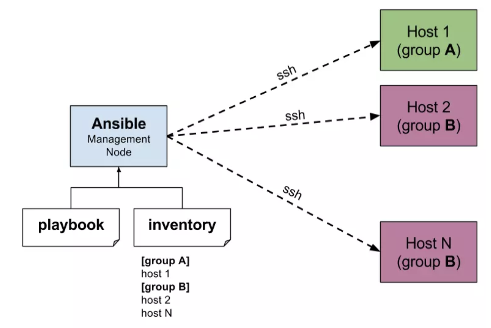

- Infra as code
  

- Inventory: list managed nodes
- Playbook: deploy and configure managed nodes

- Inventory
  - Group
- Playbook

  - Task

- Control node
- Manage nodes
- Inventory
- Playbooks
  - Play
    - Roles: reusable Ansible content (tasks, handlers, variables, plugins, templates and files)
    - Tasks
    - Handlers
- Modules
- Plugins
- Collections

Source: https://public.tiozaodolinux.com/pdf/ansible-for-devops.pdf	 
